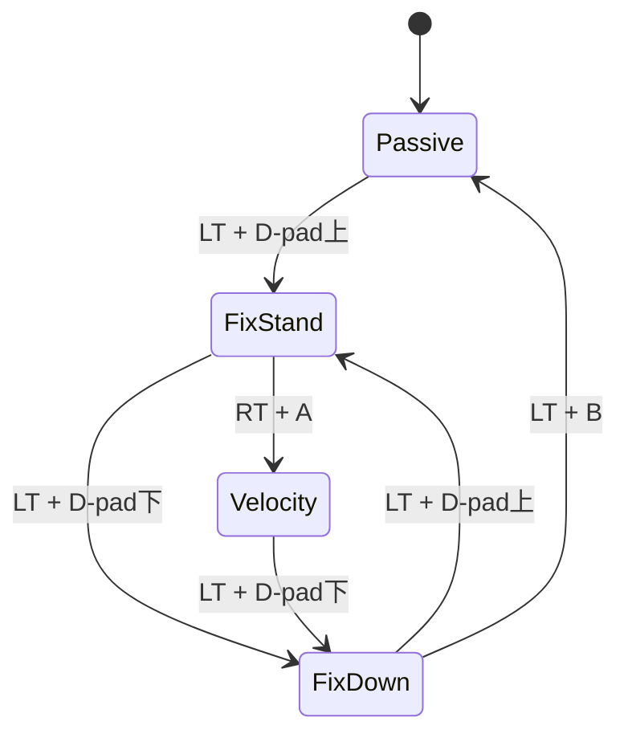

# Unitree B2YGX 代码分析

> 本文档对 `unitree_b2ygx` 机器人在 `unitree_rl_mjlab` 项目中的完整代码进行系统性分析，涵盖物理模型、训练配置、RL 算法参数及实机部署流程。

---

## 1. 项目文件结构总览

```
unitree_rl_mjlab/
├── src/assets/robots/unitree_b2ygx/       # 机器人资产定义
│   ├── __init__.py                         # 包声明
│   ├── b2ygx_constants.py                  # 核心常量、执行器、碰撞、关节配置
│   └── xmls/
│       ├── b2ygx.xml                       # MJCF 机器人模型 (247行)
│       ├── scene_b2ygx.xml                 # 场景文件 (地面+灯光)
│       └── assets/                         # 网格文件 (.obj/.STL)
├── src/tasks/velocity/config/b2ygx/        # RL 训练任务配置
│   ├── __init__.py                         # 任务注册 (Rough/Flat)
│   ├── env_cfgs.py                         # 环境配置 (观测/奖励/终止条件)
│   └── rl_cfg.py                           # PPO 超参数
├── deploy/robots/b2ygx/                    # 实机部署代码 (C++)
│   ├── CMakeLists.txt                      # 构建系统
│   ├── main.cpp                            # 入口程序
│   ├── include/Types.h                     # 类型定义
│   ├── src/State_RLBase.cpp                # RL 推理状态实现
│   ├── config/config.yaml                  # FSM + 部署参数
│   └── README.md                           # 部署说明
└── simulate/config.yaml                    # MuJoCo 仿真配置 (当前选中 b2ygx)
```

---

## 2. MJCF 物理模型 (`b2ygx.xml`)

### 2.1 刚体树结构

```
base_link (浮动基座)
├── FL_hip → FL_thigh → FL_calf (含 foot site)
├── FR_hip → FR_thigh → FR_calf (含 foot site)
├── RL_hip → RL_thigh → RL_calf (含 foot site)
└── RR_hip → RR_thigh → RR_calf (含 foot site)
```

每条腿包含 3 个旋转关节：`hip_joint`（绕 X 轴）、`thigh_joint`（绕 Y 轴）、`calf_joint`（绕 Y 轴），共 **12 个自由度**。

### 2.2 关键物理参数

| 部件 | 质量 (kg) | 备注 |
|------|----------|------|
| base_link | 40.84 | 含雷达、摄像头等附件 |
| hip (×4) | 2.93 | 各腿髋关节 |
| thigh (×4) | 7.90 | 各腿大腿 |
| calf (×4) | 0.68 | 各腿小腿 |
| **总计** | **≈87.88** | |

### 2.3 几何尺寸

| 参数 | 值 |
|------|-----|
| base collision box | 0.315 × 0.162 × 0.092 m |
| 雷达碰撞体 (cylinder) | R=0.076, H=0.08 m |
| hip 位置 (前后/左右) | ±0.3945 / ±0.09 m |
| thigh 偏移 (Y) | ±0.13225 m |
| thigh 长度 (Z) | 0.354 m |
| calf 长度 (Z) | 0.35 m |
| foot 半径 (球体) | 0.032 m |

### 2.4 关节限位 (弧度)

| 关节 | 下限 | 上限 |
|------|------|------|
| hip_joint | -0.70 | 0.70 |
| thigh_joint | -0.94 | 1.69 |
| calf_joint | -2.62 | -0.43 |

### 2.5 执行器 (Actuator)

XML 中定义了 12 个 `motor` 执行器：

| 类型 | 控制范围 (Nm) |
|------|-------------|
| hip (×4) | ±200 |
| thigh (×4) | ±200 |
| calf (×4) | ±300 |

### 2.6 传感器

XML 中定义了 39 个传感器标量通道，全部由 MuJoCo 引擎在 `mj_step()` 后写入 `mjData.sensordata`：

| XML 传感器类型 | 名称 | 数量 | 维度 | MuJoCo 数据来源 | 实机 SDK 可获取 |
|---------------|------|------|------|----------------|---------------|
| `jointpos` | `*_pos` | 12 | 12 | `mjData.qpos` (关节广义坐标) | ✅ `motor_state.q()` (编码器) |
| `jointvel` | `*_vel` | 12 | 12 | `mjData.qvel` (关节广义速度) | ✅ `motor_state.dq()` (编码器差分) |
| `jointactuatorfrc` | `*_torque` | 12 | 12 | `mjData.actuator_force` (noise=0.01) | ⚠️ `motor_state.tau_est()` 可获取但**部署未使用** |
| `framequat` | `imu_quat` | 1 | 4 | site 姿态矩阵 → 四元数 | ✅ `imu_state.quaternion()` (IMU 融合) |
| `gyro` | `imu_ang_vel` | 1 | 3 | 刚体角速度投影到 site 局部坐标系 | ✅ `imu_state.gyroscope()` |
| `velocimeter` | `imu_lin_vel` | 1 | 3 | 刚体线速度投影到 site 局部坐标系 | ❌ 实机无法直接获取 |
| `accelerometer` | `imu_lin_acc` | 1 | 3 | 刚体线加速度+重力，投影到 site 局部系 | ⚠️ `imu_state.accelerometer()` 有但**部署未使用** |
| `gyro` | `imu_gyro` | 1 | 3 | 与 `imu_ang_vel` 重复 | ✅ (同上) |
| `accelerometer` | `imu_acc` | 1 | 3 | 与 `imu_lin_acc` 重复 | ⚠️ (同上) |
| `subtreeangmom` | `root_angmom` | 1 | 3 | `mjData.subtree_angmom` (base_link 子树角动量) | ❌ 实机无法获取 |
| `framepos` | `frame_pos` | 1 | 3 | `mjData.site_xpos` (IMU site 世界坐标位置) | ❌ 实机无全局定位 |
| `framelinvel` | `frame_vel` | 1 | 3 | site 线速度 (世界坐标系) | ❌ 实机无全局速度 |

- 所有 IMU 传感器绑定在 `imu` site (`pos="0 -0.02341 0.04927"`，安装在 base_link 上)
- `imu_gyro`/`imu_acc` 与 `imu_ang_vel`/`imu_lin_acc` 是重复定义，实际独立 IMU 通道为 4+3+3+3=13 个
- **部署时仅使用 4 种数据**: 关节位置、关节速度、IMU 四元数 (转 projected_gravity)、IMU 陀螺仪


### 2.7 碰撞体系

模型采用**视觉/碰撞分离**设计：
- `group=1`: 视觉网格 (`contype=0, conaffinity=0`)
- `group=3 (class="collision")`: 碰撞体 (`mass=0, density=0`)
- base 有 4 个碰撞体 (box + cylinder)
- 每条腿: hip(1 cylinder) + thigh(1 box) + calf(4 box) + foot(1 sphere)
- foot 摩擦系数: `0.4, 0.005, 0.0001`

### 2.8 Keyframe

```
home: pos=(0, 0, 0.546), quat=(1,0,0,0)
       hip=0, thigh=0.8, calf=-1.5 (四腿相同)
```

---

## 3. Python 资产配置 (`b2ygx_constants.py`)

### 3.1 执行器配置 (BuiltinPositionActuatorCfg)

训练时采用**位置控制**模式 (PD 控制器)：

| 参数 | hip | thigh | calf |
|------|-----|-------|------|
| stiffness (kp) | 200.0 | 200.0 | 240.0 |
| damping (kd) | 10.0 | 10.0 | 12.0 |
| effort_limit | 200.0 | 200.0 | 300.0 |
| armature | 0.1 | 0.1 | 0.1 |

### 3.2 碰撞配置

提供两种碰撞模式：
- **FEET_ONLY_COLLISION**: 仅 foot 参与碰撞，`condim=3`, `friction=0.6`, `solimp=(0.9, 0.95, 0.023)`
- **FULL_COLLISION** (默认使用): 所有 `*_collision` 几何体参与，foot 特殊处理 (`condim=3`, `priority=1`, `friction=0.6`)，其余碰撞体 `condim=1`

### 3.3 初始状态

```python
pos = (0.0, 0.0, 0.546)     # 初始高度 0.546m
joint_pos = {
    ".*thigh_joint": 0.8,     # 大腿弯曲
    ".*calf_joint": -1.5,     # 小腿弯曲
    ".*hip_joint": 0.0,       # 髋关节居中
}
joint_vel = {".*": 0.0}       # 零初始速度
```

---

## 4. RL 训练配置

### 4.1 任务注册

在 `__init__.py` 中注册了两个任务：

| 任务 ID | 地形类型 | Runner |
|---------|---------|--------|
| `Unitree-B2YGX-Rough` | 粗糙地形 (curriculum) | VelocityOnPolicyRunner |
| `Unitree-B2YGX-Flat` | 平面地形 | VelocityOnPolicyRunner |

### 4.2 PPO 超参数 (`rl_cfg.py`)

| 参数 | 值 |
|------|-----|
| **Actor 网络** | [512, 256, 128], ELU, obs_normalization |
| **Critic 网络** | [512, 256, 128], ELU, obs_normalization |
| **动作分布** | GaussianDistribution, init_std=1.0, scalar |
| clip_param | 0.2 |
| entropy_coef | 0.01 |
| learning_rate | 1e-3 |
| schedule | adaptive (基于 KL 散度) |
| desired_kl | 0.01 |
| gamma | 0.99 |
| lambda (GAE) | 0.95 |
| num_learning_epochs | 5 |
| num_mini_batches | 4 |
| num_steps_per_env | 24 |
| max_iterations | 10001 |
| save_interval | 100 |
| max_grad_norm | 1.0 |

### 4.3 环境配置 (`env_cfgs.py`)

#### 仿真参数

| 参数 | Rough | Flat |
|------|-------|------|
| ccd_iterations | 500 | 50 |
| contact_sensor_maxmatch | 500 | 64 |
| njmax | 默认 | 300 |
| terrain_type | rough (curriculum) | plane |

#### 传感器配置

- **feet_ground_contact**: 监测 4 个 foot 与地面接触，跟踪 air_time，netforce 归约
- **nonfoot_ground_touch**: 监测非 foot 碰撞体与地面接触，history_length=4 (用于非法接触检测)
- **terrain_scan** (仅 Rough): 射线投射传感器，挂载于 `base_link`

#### 步态与奖励

步态偏移 `[0.0, 0.5, 0.5, 0.0]` 表示 **对角步态 (trot)**：FR-RL 同相，FL-RR 同相。

**姿态惩罚标准差** (3 种运动状态)：

| 关节 | standing | walking | running |
|------|----------|---------|---------|
| hip | 0.05 | 0.15 | 0.15 |
| thigh | 0.1 | 0.35 | 0.35 |
| calf | 0.15 | 0.5 | 0.5 |

站立时约束更紧 (小标准差 → 大惩罚)，运动时允许更大偏差。

#### 终止条件

- **illegal_contact**: 非 foot 碰撞体受力超过 10N → 回合终止

#### Play 模式特殊设置

- 无限回合长度
- 关闭观测噪声
- 移除 push_robot 事件
- 清空 curriculum
- Flat play: 速度范围 `lin_vel_x=(-0.5, 1.0)`, `lin_vel_y=(-0.5, 0.5)`, `ang_vel_z=(-0.5, 0.5)`

### 4.4 观测空间 (`velocity_env_cfg.py`)

#### Actor 观测 (策略网络输入，部署时使用)

| 观测项 | 函数 | 维度 | 噪声 | 实机来源 |
|--------|------|------|------|---------|
| `base_ang_vel` | `builtin_sensor("imu_ang_vel")` | **3** | ±0.2 | SDK `imu_state.gyroscope()` |
| `projected_gravity` | `projected_gravity` | **3** | ±0.05 | SDK `imu_state.quaternion()` → 重力投影 |
| `command` | `generated_commands("twist")` | **3** | 无 | 手柄输入 (vx, vy, ωz) |
| `phase` | `phase(period=0.6)` | **2** | 无 | 本地 sin/cos 计算 |
| `joint_pos` | `joint_pos_rel` | **12** | ±0.01 | SDK `motor_state.q()` - 默认关节角 |
| `joint_vel` | `joint_vel_rel` | **12** | ±1.5 | SDK `motor_state.dq()` |
| `actions` | `last_action` | **12** | 无 | 上一步策略输出缓存 |
| `height_scan` | `height_scan("terrain_scan")` | **176** | ±0.1 | ⚠️ 仅 Rough，实机需雷达点云 |
| **合计** | | **Rough: 223** | | |
| | | **Flat: 47** | | |

- `history_length=1`，无历史帧堆叠
- `joint_pos_rel` / `joint_vel_rel` 是相对默认姿态的偏差值
- `height_scan` 使用 GridPattern `1.6×1.0m, resolution=0.1`，即 16×11=176 个射线点，归一化系数 `1/5.0`
- Flat 任务中删除 `height_scan`，actor 输入仅 47 维
- **所有 actor 观测项均可在实机上获取**，确保 sim-to-real 可行

**`projected_gravity` 计算详解**：

将世界坐标系的重力方向投影到机体坐标系，公式为：

```
g_b = q⁻¹ * [0, 0, -1]
```

其中 `q` 是 IMU 输出的机体姿态四元数 (世界 → 机体)。

| 机体状态 | `projected_gravity` 值 | 含义 |
|---------|----------------------|------|
| 水平站立 | [0, 0, -1] | 重力沿机体 Z 轴向下 |
| 前倾 30° | [-0.5, 0, -0.87] | X 轴出现分量 |
| 右侧倾 | [0, -0.5, -0.87] | Y 轴出现分量 |

实机计算 (`unitree_articulation.h:29-35`):

```cpp
data.root_quat_w = Eigen::Quaternionf(imu_state().quaternion());
data.projected_gravity_b = data.root_quat_w.conjugate() * GRAVITY_VEC_W;
```

数据链路: IMU 芯片 (加速度计+陀螺仪) → 板载 EKF 融合 → `quaternion()` → `q⁻¹ * g_w` → 3 维观测

**设计优势**: 该观测是 **yaw-invariant** 的 — 绕重力轴旋转不改变 `g_b`，因此策略网络只感知 roll/pitch 而不依赖航向角，这对速度跟踪任务是理想的。

#### Critic 观测 (价值网络输入，仅训练时使用)

包含 Actor 的全部观测，额外增加以下**特权信息** (实机不可获取):

| 额外观测项 | 函数 | 维度 | 说明 |
|-----------|------|------|------|
| `base_lin_vel` | `builtin_sensor("imu_lin_vel")` | **3** | 基座线速度 (实机无全局速度) |
| `height_scan` (无噪声) | `height_scan` | **176** | 无噪声版地形扫描 |
| `foot_height` | `foot_height` | **4** | 4 个足端离地高度 |
| `foot_air_time` | `foot_air_time` | **4** | 4 个足端滞空时间 |
| `foot_contact` | `foot_contact` | **4** | 4 个足端接触状态 |
| `foot_contact_forces` | `foot_contact_forces` | **4** | 4 个足端接触力 |

Critic 使用特权信息辅助价值函数估计 (asymmetric actor-critic)，提升训练效率但不影响部署。

---

## 5. 实机部署代码 (C++)


### 5.1 构建系统

- **目标**: `b2ygx_ctrl` 可执行文件
- **依赖**: unitree_sdk2, Boost (program_options), yaml-cpp, fmt, ONNX Runtime
- **平台**: 支持 x86_64 和 aarch64 (自动选择 ONNX Runtime 版本)
- **通信**: 使用 Unitree DDS (ddsc/ddscxx) 实现 LowCmd/LowState 通信
- **类型别名**: `LowCmd_t = unitree::robot::go2::publisher::LowCmd`, `LowState_t = ...::LowState`

### 5.2 主程序流程 (`main.cpp`)

```
1. 解析命令行参数
2. 初始化 DDS 通信通道 (domain_id + network)
3. release_motion_control_service()  // 抢占运动服务
4. init_fsm_state()                  // 初始化 lowcmd/lowstate、等待连接
5. 创建 CtrlFSM 并启动
6. 主循环 (sleep)
```

#### 运动服务抢占逻辑

通过 `MotionSwitcherClient` (B2 SDK) 查询并释放正在运行的运动服务 (sport_mode / ai_sport 等)，循环尝试直到成功。

#### lowcmd 通道安全检查

启动前检查 lowcmd 通道是否已被其他进程占用，避免冲突。

#### 实机手柄输入

`b2ygx_ctrl` 在实机部署时可读取本机手柄输入，并覆盖到 FSM 使用的 `lowstate->joystick`。这用于解决 `--network=lo` 下仿真手柄正常、但 `--network=wlp4s0` 等真实网卡下按键不触发状态切换的问题：仿真 bridge 会把本机手柄写入 `rt/lowstate.wireless_remote`，真实机器人低状态不一定包含本机手柄事件，因此控制器需要在本机侧补充 joystick 输入。

```yaml
Joystick:
  enabled: true
  type: xbox
  device: /dev/input/js0
  bits: 16
```

输入链路:

```text
/dev/input/js0 -> LocalJoystick -> FSMState::lowstate->joystick -> FSM transitions
```

如果实机网卡下不切状态，检查 `Joystick.enabled`、`device` 路径以及 input 设备权限。设备重插后可能从 `/dev/input/js0` 变为 `/dev/input/js1`。

### 5.3 FSM 状态机 (`config.yaml`)



#### 状态详情

| 状态 | ID | 说明 |
|------|----|------|
| **Passive** | 1 | 电机阻尼模式 (mode=10, kd=3)，机器人无力 |
| **FixStand** | 2 | PD 站立 (kp=400, kd=12)，两阶段插值 |
| **FixDown** | 3 | PD 蹲下 (kp=400, kd=12)，蜷腿姿态 |
| **Velocity** | 4 | RL 策略推理 (type=RLBase) |

#### FixStand 插值轨迹

```
t=0s: 当前关节角 (从 lowstate 读取)
t=1s: 蜷腿 [hip=0, thigh=1.36, calf=-2.60] ×4
t=2s: 展开 [hip=0, thigh=0.80, calf=-1.50] ×4
```

先蜷腿再展开，避免站立过程中腿部碰撞。

### 5.4 RL 推理状态 (`State_RLBase.cpp`)

```cpp
// 初始化
env = ManagerBasedRLEnv(deploy.yaml, BaseArticulation(lowstate));
env->alg = OrtRunner(policy.onnx);

// 安全检查: 倾斜超阈值(1.0 rad) → 切回 Passive
registered_checks: bad_orientation(threshold=1.0)

// 运行循环
action = env->action_manager->processed_actions();
for each joint:
    lowcmd->motor_cmd[joint_ids_map[i]].q() = action[i];
```

**关节映射**: `joint_ids_map = [3,4,5,0,1,2,9,10,11,6,7,8]`

这是从训练时的关节顺序 (FL→FR→RL→RR) 到 SDK 关节顺序 (FR→FL→RR→RL) 的映射。

---

## 6. 与 B2 的对比

| 参数 | B2 | B2YGX | 差异 |
|------|-----|-------|------|
| stiffness (hip/thigh) | 200 | 200 | 相同 |
| damping (hip/thigh) | 10 | 10 | 相同 |
| stiffness (calf) | 240 | 240 | 相同 |
| damping (calf) | 12 | 12 | 相同 |
| base collision box | 0.25×0.14×0.075 | 0.315×0.162×0.092 | B2YGX 更大 |
| hip 位置 (前后) | ±0.3285 | ±0.3945 | B2YGX 轴距更长 |
| hip 位置 (左右) | ±0.072 | ±0.09 | B2YGX 更宽 |
| hip 质量 | 2.53 kg | 2.93 kg | B2YGX 更重 |
| thigh 质量 | 7.46 kg | 7.90 kg | B2YGX 更重 |
| base 质量 | ~38 kg | 40.84 kg | B2YGX 更重 |

**总结**: B2YGX 是 B2 的升级版，体型更大、更重，但关节采用更低的 PD 增益，运动更柔顺。

---

## 7. 数据流总览

```
训练 (Python/MuJoCo)                    部署 (C++/实机)
┌─────────────────────┐                 ┌──────────────────────┐
│  env_cfgs.py        │                 │  config.yaml (FSM)   │
│  ├─ 观测空间        │    导出 ONNX    │  deploy.yaml (env)   │
│  ├─ 动作空间        │ ─────────────→  │  policy.onnx (模型)  │
│  ├─ 奖励函数        │                 │                      │
│  └─ 终止条件        │                 │  State_RLBase.cpp    │
│                     │                 │  ├─ OrtRunner 推理   │
│  rl_cfg.py          │                 │  ├─ joint_ids_map    │
│  └─ PPO 超参数      │                 │  └─ bad_orientation  │
│                     │                 │                      │
│  b2ygx_constants.py │                 │  main.cpp            │
│  ├─ 执行器 PD 参数  │                 │  ├─ 释放运动服务     │
│  ├─ 初始状态        │                 │  ├─ 初始化 DDS       │
│  └─ 碰撞配置        │                 │  └─ 启动 FSM         │
└─────────────────────┘                 └──────────────────────┘
```

---

## 8. 速度课程 (Velocity Curriculum)

训练采用课程学习 (Curriculum Learning)，包含速度指令渐进、地形难度升级和姿态自适应三个维度。

### 8.1 速度指令课程 (`command_vel`)

通过 `CurriculumTermCfg` 分两阶段扩大速度指令范围 (`velocity_env_cfg.py:377-386`)：

| 阶段 | 触发条件 | lin_vel_x (m/s) | lin_vel_y (m/s) | ang_vel_z (rad/s) |
|------|---------|----------------|----------------|-------------------|
| **阶段 1** | step 0 起 | [-0.5, 1.0] | [-0.5, 0.5] | [-1.0, 1.0] |
| **阶段 2** | step > 120,000 | [-1.0, 2.0] | [-1.0, 1.0] | [-1.0, 1.0] |

- 切换点 = 5000 iters × 24 steps/iter = 120,000 步，约训练进度的 **50%**
- 角速度全程不变，仅线速度范围翻倍
- 实现逻辑：`curriculums.py:commands_vel()` 遍历所有 stage，`common_step_counter > step` 时覆盖 `cfg.ranges`

**设计意图**: 先慢后快，初期给保守速度让机器人学会基本行走，中期扩大范围训练高速运动能力。

### 8.2 地形课程 (`terrain_levels`) — 仅 Rough 任务

根据每个环境 reset 时机器人的行走距离动态调整地形难度 (`curriculums.py:terrain_levels_vel()`)：

| 条件 | 计算方式 | 结果 |
|------|---------|------|
| **升级** | `distance > terrain_size[0] / 2` | 地形难度 +1 |
| **降级** | `distance < cmd_vel × episode_length × 0.5` | 地形难度 -1 |

- 升级优先: `move_down *= ~move_up`
- 初始最高难度: `max_init_terrain_level=5`
- Flat 任务中通过 `cfg.curriculum.pop("terrain_levels", None)` 移除

### 8.3 姿态奖励的速度自适应

`variable_posture` 奖励根据当前指令速度在三档间切换姿态约束 (`velocity_env_cfg.py:277-288`)：

| 关节 | standing (< 0.1 m/s) | walking (< 1.5 m/s) | running (≥ 1.5 m/s) | standing 紧多少 |
|------|---------------------|--------------------|--------------------|----------------|
| hip | **0.05** | 0.15 | 0.15 | **3×** |
| thigh | **0.1** | 0.35 | 0.35 | **3.5×** |
| calf | **0.15** | 0.5 | 0.5 | **3.3×** |

- 使用高斯核 `exp(-Δq²/std²)`，std 越小对偏差惩罚越大
- standing 的 std 仅为 walking/running 的 **约 1/3**，站立时必须保持默认姿态基本不动
- walking 与 running 标准差**完全相同**，未做区分
- 切换阈值: `walking_threshold=0.1`, `running_threshold=1.5` (指令速度的范数)

### 8.4 步态配置

| 参数 | 值 | 说明 |
|------|-----|------|
| 步态类型 | 对角步态 (trot) | offset=[0.0, 0.5, 0.5, 0.0]，FL-RR 同相，FR-RL 同相 |
| 步态周期 | 0.6s | |
| 相位观测 | period=0.6, 输入 actor | 机器人知道当前步态相位 |
| foot_clearance 目标 | 0.10m | 抬脚高度目标 |

### 8.5 课程时间线

```
iteration:    0          2500         5000         7500        10000
step:         0        60,000      120,000      180,000     240,000
              │                      │                        │
速度范围:     ├──── 阶段1 ───────────┤──── 阶段2 ─────────────┤
              │  x:(-0.5,1.0)        │  x:(-1.0,2.0)          │
              │  y:(-0.5,0.5)        │  y:(-1.0,1.0)          │
              │                      │                        │
地形(Rough):  ├── 根据行走距离动态升降级 ─────────────────────┤
```

---

## 9. 训练与部署命令

### 新训练

```bash
# Flat 地形训练
python scripts/train.py Unitree-B2YGX-Flat --agent.logger=tensorboard --env.scene.num-envs=4096

# Rough 地形训练 (含 curriculum)
python scripts/train.py Unitree-B2YGX-Rough --agent.logger=tensorboard --env.scene.num-envs=4096
```

### 继续训练 (Resume)

```bash
# 从指定 checkpoint 继续训练
python scripts/train.py Unitree-B2YGX-Flat \
  --agent.resume=True \
  --agent.load-run=<run_dir_name> \
  --agent.load-checkpoint=<model_file> \
  --agent.logger=tensorboard \
  --env.scene.num-envs=4096

# 示例: 从最新 run 的 model_10000 继续
python scripts/train.py Unitree-B2YGX-Flat \
  --agent.resume=True \
  --agent.load-run=2026-04-26_22-10-43 \
  --agent.load-checkpoint=model_10000.pt \
  --agent.logger=tensorboard \
  --env.scene.num-envs=4096
```

| 参数 | 作用 |
|------|------|
| `--agent.resume=True` | 启用恢复模式 |
| `--agent.load-run` | 指定 `logs/rsl_rl/b2ygx_velocity/` 下的 run 目录名 |
| `--agent.load-checkpoint` | 指定 checkpoint 文件 (如 `model_10000.pt`) |

### 查看训练曲线

```bash
# 查看 b2ygx 所有训练 run
tensorboard --logdir=logs/rsl_rl/b2ygx_velocity --bind_all

# 查看特定 run
tensorboard --logdir=logs/rsl_rl/b2ygx_velocity/2026-04-26_22-10-43 --bind_all

# 对比所有机器人的训练曲线
tensorboard --logdir=logs/rsl_rl --bind_all
```

浏览器打开 `http://localhost:6006` 查看。

### 训练产物与 ONNX 保存规则

训练结果默认保存在：

```text
logs/rsl_rl/b2ygx_velocity/<run>/
```

`save_interval=100`，因此每 100 次迭代会保存一个 `.pt` checkpoint，并同步导出对应的 ONNX 策略：

| PyTorch checkpoint | ONNX 策略 |
|--------------------|-----------|
| `model_100.pt` | `policy_100.onnx` |
| `model_200.pt` | `policy_200.onnx` |
| `model_<iter>.pt` | `policy_<iter>.onnx` |

同一目录下还会保留一个覆盖式 `policy.onnx`，它始终指向最近一次保存的策略，便于快速部署；如果要回放或安装某个指定 checkpoint，应优先选择与 `model_<iter>.pt` 对应的 `policy_<iter>.onnx`。

### 仿真回放

```bash
python scripts/play.py Unitree-B2YGX-Flat --checkpoint <path_to_model>
python scripts/play.py Unitree-B2YGX-Rough --checkpoint <path_to_model>
```

### 部署编译

```bash
cd deploy/robots/b2ygx
mkdir build && cd build
cmake ..
make
# 产物: b2ygx_ctrl
```

### ONNX 模型路径

```
deploy/robots/b2ygx/config/policy/velocity/v0/exported/policy.onnx
```

---

## 10. 注意事项

1. **关节顺序不一致**: 训练环境按 FL→FR→RL→RR 排列，SDK 按 FR→FL→RR→RL 排列，部署时需通过 `joint_ids_map` 映射。
2. **PD 参数差异**: 训练时 hip/thigh kp=200/kd=10, calf kp=240/kd=12，FixStand 时 kp=400/kd=12，部署推理时使用训练值。
3. **Types.h 使用 go2 命名空间**: 底层 DDS 通信复用了 go2 的 LowCmd/LowState 类型定义。
4. **碰撞设计**: 训练默认使用 FULL_COLLISION，所有碰撞体都参与，foot 有特殊的接触参数。
5. **安全机制**: 部署时 `bad_orientation` 阈值为 1.0 rad (约 57°)，倾斜过大自动回 Passive。
6. **速度课程切换**: 训练到 50% 进度 (5000 iter) 时速度范围自动翻倍，注意观察此时训练曲线是否有波动。
